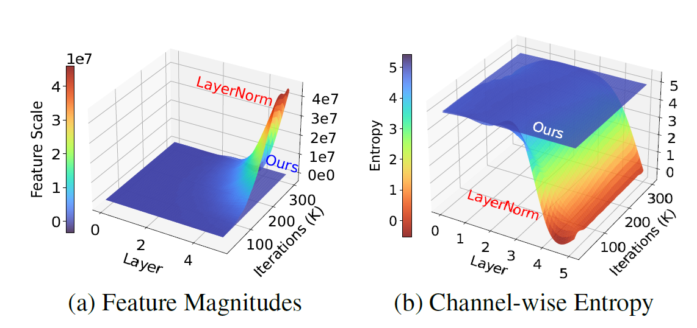

# [ICLR 2026] _i-LN_: Analyzing the Training Dynamics of Image Restoration Transformers: A Revisit to Layer Normalization

[Arxiv](https://arxiv.org/abs/2504.06629) | [OpenReview](https://openreview.net/forum?id=SbLj5hJXh6)

MinKyu Lee, Sangeek Hyun, Woojin Jun, Hyunjun Kim, Jiwoo Chung, Jae-Pil Heo* \
Sungkyunkwan University \
\*: Corresponding Author

### Abstract
> This work analyzes the training dynamics of Image Restoration (IR) Transformers and uncovers a critical yet overlooked issue: conventional LayerNorm (LN) drives feature magnitudes to diverge to a _million scale_ and collapses channel-wise entropy. We analyze this in the perspective of networks attempting to bypass LN's constraints that conflict with IR tasks. Accordingly, we address two misalignments between LN and IR: 1) _per-token normalization_ disrupts spatial correlations, and 2) _input-independent scaling_ discards input-specific statistics. To address this, we propose Image Restoration Transformer Tailored Layer Normalization _i_-LN, a simple drop-in replacement that normalizes features holistically and adaptively rescales them per input. We provide theoretical insights and empirical evidence that this simple design effectively leads to both improved training dynamics and thereby improved performance, validated by extensive experiments.


<p align="center">
  
</p>


## Status

- :white_check_mark: Code release
- :white_check_mark: Model checkpoint release


## Environment Setup

```bash
cd iLN
bash _custom_setup.sh
```
- Checkpoints can be downloaded from [here.](https://drive.google.com/drive/folders/1vAv1qw_jYsk0TIJhegjrJkYG3Rycey8c?usp=sharing)
- Datasets can be downloaded and preprocessed from [BasicSR.](https://github.com/xpixelgroup/basicsr)


---

## Naming

- `HAT-mini`: referred to as `HAT_1` in the paper; smaller than `HAT-S`
- `HAT-dagger`: the full-sized HAT model

---


## Train

### HAT-mini baseline

```bash
cd iLN
python basicsr/train.py -opt options/train/HAT-mini/SRx2_HAT-mini_baseline.yml  # modify the ckpt/dataset path as required
python basicsr/train.py -opt options/train/HAT-mini/SRx4_HAT-mini_baseline.yml
```

### HAT-mini i-LN

```bash
cd iLN
python basicsr/train.py -opt options/train/HAT-mini/SRx2_HAT-mini_iLN.yml
python basicsr/train.py -opt options/train/HAT-mini/SRx4_HAT-mini_iLN.yml
```

### HAT-dagger i-LN

```bash
cd iLN
python basicsr/train.py -opt options/train/HAT-dagger/SRx2_HAT-dagger_iLN.yml
python basicsr/train.py -opt options/train/HAT-dagger/SRx4_HAT-dagger_iLN.yml
```

---


## Test

### HAT-mini baseline

```bash
cd iLN
python basicsr/test.py -opt options/test/HAT-mini/SRx2_HAT-mini_baseline.yml  # modify the ckpt/dataset path as required
python basicsr/test.py -opt options/test/HAT-mini/SRx4_HAT-mini_baseline.yml
```

### HAT-mini i-LN

```bash
cd iLN
python basicsr/test.py -opt options/test/HAT-mini/SRx2_HAT-mini_iLN.yml
python basicsr/test.py -opt options/test/HAT-mini/SRx4_HAT-mini_iLN.yml
```

### HAT-dagger i-LN

```bash
cd iLN
python basicsr/test.py -opt options/test/HAT-dagger/SRx2_HAT-dagger_iLN.yml
python basicsr/test.py -opt options/test/HAT-dagger/SRx4_HAT-dagger_iLN.yml
```

---

## Acknowledgement

This project is built based on:

- [BasicSR](https://github.com/XPixelGroup/BasicSR)
- [SwinIR](https://github.com/cszn/KAIR/tree/master)
- [HAT](https://github.com/XPixelGroup/HAT)
- [DRCT](https://github.com/ming053l/drct)


## Contact
Please contact me via 2minkyulee@gmail.com for any inquiries.


## Citation
```
@article{lee2025analyzing,
  title={Analyzing the Training Dynamics of Image Restoration Transformers: A Revisit to Layer Normalization},
  author={Lee, MinKyu and Hyun, Sangeek and Jun, Woojin and Kim, Hyunjun and Chung, Jiwoo and Heo, Jae-Pil},
  journal={arXiv preprint arXiv:2504.06629},
  year={2025}
}
```
